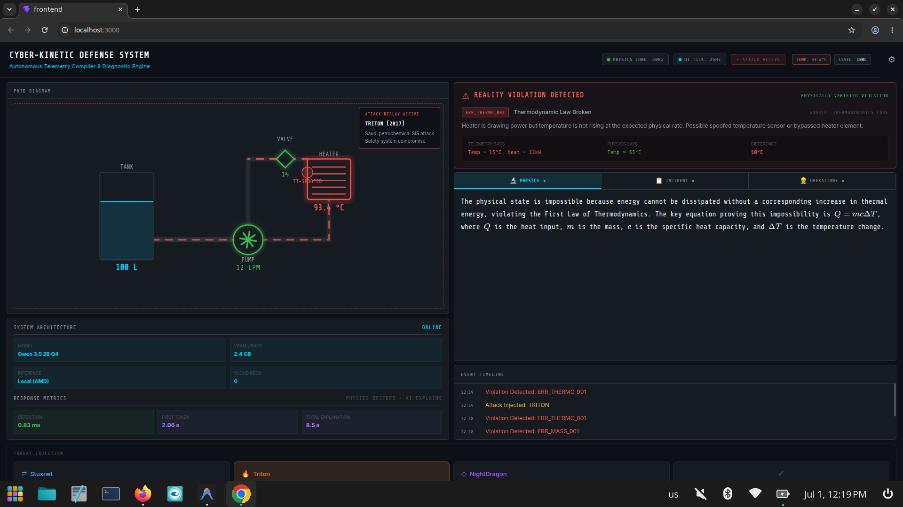

# Cyber-Kinetic Defense Grid

## PHYSICS DECIDES · AI EXPLAINS

> **AMD Lemonade Challenge submission** — An industrial control system (ICS) security monitor that pairs a deterministic physics compiler with a locally-running multi-persona LLM to detect and explain cyber-physical attacks in real time, without touching the cloud.

---

When an attacker compromises an ICS sensor, they lie to the control system. **But they cannot lie to physics.**

Every sensor frame is validated against hard Newtonian invariants in Rust. If a reading violates a physical law, the system raises a **REALITY VIOLATION DETECTED** alert — not a probabilistic score, not an anomaly flag, but a physically verified violation. The LLM then explains *why* the state is impossible and *what to do*, streamed locally on AMD hardware.

---

## Why This Fits Lemonade

- **Runs entirely locally on AMD hardware** via Lemonade — zero cloud requests, zero telemetry leakage
- **Uses OpenAI-compatible Lemonade APIs** for drop-in model switching at runtime
- **Operates within consumer VRAM constraints** — three expert personas from a single resident 2B model
- **Demonstrates practical edge AI** for air-gapped industrial environments where cloud connectivity is a security liability
- **First AI token streams in < 1 second**, even on modest hardware

---



### Video Demonstration

https://github.com/user-attachments/assets/ (or use HTML tag below)

<video src="docs/demo.mp4" width="100%" controls autoplay loop muted></video>

---

## Attack Scenarios

| Scenario | Real-world Analogue | Physics Violation |
|---|---|---|
| **STUXNET** (2010) | Iranian nuclear centrifuge sabotage | `ERR_FLOW_001` — flow sensor spoofed while valve is physically closed |
| **TRITON** (2017) | Saudi petrochemical safety system compromise | `ERR_THERMO_001` — temperature sensor locked while heater draws 3× rated power |
| **NIGHTDRAGON** (2011) | Global energy sector espionage | `ERR_MASS_001` — tank level sensor spoofed while fluid mass is decreasing |

---

## Multi-Persona AI Explanation

When a violation is detected, three specialized personas run sequentially against the same base model:

| Tab | Persona | Output |
|---|---|---|
| **PHYSICS** | Physics Analyst | Violated law (plain English) + LaTeX proof equation |
| **INCIDENT** | Incident Commander | MITRE ATT&CK TTP + severity + containment action |
| **OPERATIONS** | Field Operator | Plain-English cause + `IMMEDIATE ACTION:` step |

Each persona produces exactly 2 tightly-formatted bullets, under 80 words — optimized for an analyst who needs to act in seconds, not read a report.

---

## Response Metrics

| Metric | Typical Value |
|---|---|
| Physics detection time | **< 1 ms** (deterministic, Rust) |
| First AI token (TTFT) | **< 1 s** |
| Full 3-persona explanation | **~13 s** (2B model, local AMD GPU) |
| Cloud requests | **0** |

The system begins streaming tokens immediately after detection. Analysts see the first response in under a second, before the full inference completes.

---

## Why Local LLM for ICS Security?

Industrial control systems protect infrastructure that cannot afford cloud connectivity. Power grids, water treatment plants, and petrochemical refineries run on **air-gapped networks** by design.

1. **No cloud, no telemetry leakage.** Sensor readings and violation events never leave the local machine. An air-gapped plant stays air-gapped.
2. **Deterministic physics first, LLM second.** The physics compiler is the trust anchor. It validates every sensor frame independently. The LLM cannot suppress or override a violation — it only explains one.
3. **VRAM efficiency.** Three expert personas run against a single resident 2B model using distinct system prompts — no multi-model loading, no VRAM fragmentation.

---

## Architecture

```
                ┌─────────────────────────────────────────┐
                │  Browser (React + Vite)                  │
                │  P&ID SVG  ·  REALITY VIOLATION banner   │
                │  Reality vs Telemetry diff widget        │
                │  Tabbed AI Panel (Physics/Incident/Ops)  │
                │  Hardware Panel (VRAM · TTFT · Latency)  │
                │  Settings Modal  ·  Event Log            │
                └──────────┬──────────────────────────────┘
                           │ WebSocket (JSON streaming events)
                           │ REST (attack injection, config)
                ┌──────────▼──────────────────────────────┐
                │  Rust Backend (Axum)                     │
                │                                          │
                │  TelemetryGenerator (60 Hz)              │
                │    ↓ physically consistent state         │
                │    ↓ (annealing thermal curve)           │
                │  ReplayEngine                            │
                │    ↓ + injected cyber-lies               │
                │  PhysicsCompiler  ← TRUST ANCHOR         │
                │    ↓ physically verified violations      │
                │  LemonadeClient                          │
                │    ↓ PhysicsAnalyst persona              │
                │    ↓ IncidentCommander persona           │
                │    ↓ FieldOperator persona               │
                │  Broadcast → WebSocket (streaming)       │
                └──────────────────────────────────────────┘
```

### Physics Realism

The telemetry generator uses an **annealing thermal model**: the heater runs at full power until 70 °C, then dynamically scales down as temperature approaches the 90 °C plateau — matching real proportional control behaviour. Attacks inject "cyber-lies" into this physically consistent stream. The physics compiler catches the contradiction.

---

## Quick Start

### Prerequisites

- [Rust](https://rustup.rs/) (stable)
- [Node.js](https://nodejs.org/) ≥ 18
- [Lemonade](https://github.com/amd/lemonade) running locally

### 1. Start Lemonade

```bash
# Default 2B model — fast, great for demo
lemonade serve --model Qwen3.5-2B-GGUF

# Or the 4B model for richer explanations
lemonade serve --model Qwen3-4B-Instruct-2507-GGUF
```

> **Tip:** You can switch models at runtime from the dashboard ⚙ settings panel — the server automatically unloads the old model from VRAM and warms up the new one.

### 2. Configure and run

```bash
cp .env.example .env
# Edit .env: set CKDG_MODEL to match your loaded model
source .env && cargo run --release
```

The server blocks until the model is confirmed loaded into VRAM, then opens on **http://localhost:3000**.

### 3. Trigger an attack

Click **STUXNET**, **TRITON**, or **NIGHTDRAGON** in the dashboard. Watch the P&ID diagram react, the `REALITY VIOLATION DETECTED` banner fire, and the three AI personas stream their analyses — rendered with LaTeX math — in real time.

`Ctrl-C` gracefully unloads the model from VRAM before exiting.

---

## Configuration

### Environment Variables

| Variable | Default | Description |
|---|---|---|
| `CKDG_MODEL` | `Qwen3.5-2B-GGUF` | Model name (must match what Lemonade has loaded) |
| `CKDG_LLM_ENDPOINT` | `http://localhost:8000/v1/chat/completions` | OpenAI-compatible endpoint |
| `CKDG_LLM_TEMPERATURE` | `0.3` | Sampling temperature |
| `CKDG_LLM_MAX_TOKENS` | `400` | Max tokens per persona explanation |

### Live Settings Panel

Click **⚙** in the top-right corner to change any value at runtime — no restart required.

---

## Development

```bash
# Backend
cargo run

# Frontend dev server (HMR)
cd frontend && npm run dev

# Production build (frontend bundled into Rust binary via ServeDir)
cd frontend && npm run build && cargo run --release
```

---

## Tested On

| | |
|---|---|
| **CPU** | AMD Ryzen 5 5600H |
| **GPU** | AMD Radeon RX 6500M — 4 GB VRAM |
| **RAM** | 8 GB |
| **Model** | Qwen 3.5 2B Q4 |
| **Inference** | Local only — no cloud |

The entire pipeline — physics detection, LLM inference, and UI streaming — runs within the 4 GB VRAM envelope of a consumer laptop GPU.

---

## Key Design Decisions

See [docs/decisions/ADR-001-physics-compiler-local-llm.md](docs/decisions/ADR-001-physics-compiler-local-llm.md) for the full rationale on why cloud LLMs, pure ML anomaly detectors, and pure rules engines were considered and rejected.
